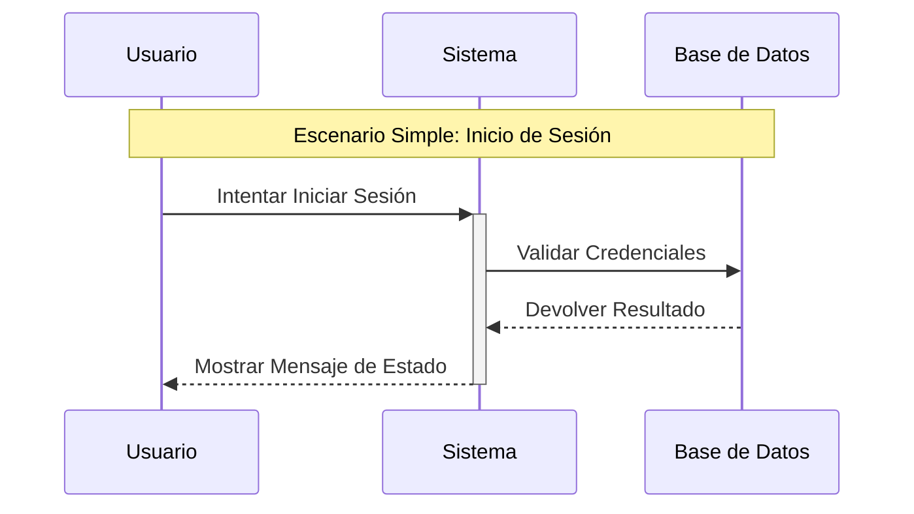
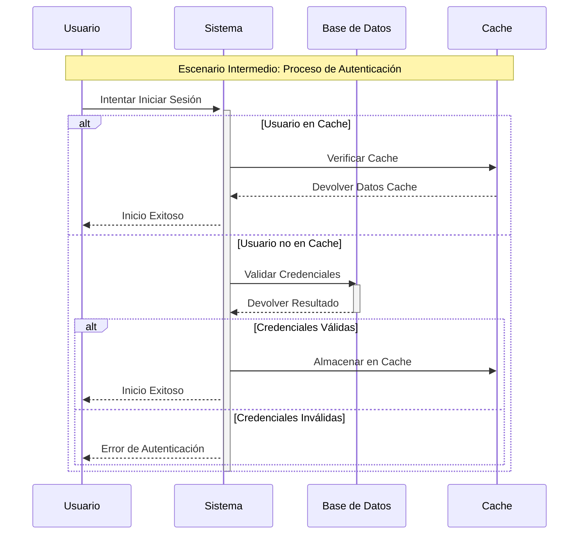
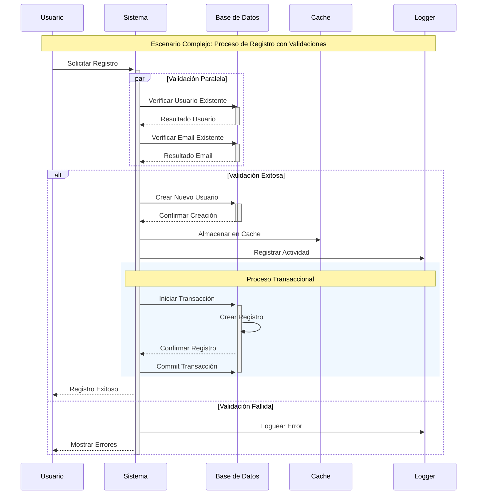

###  Componentes Fundamentales

Los diagramas secuenciales UML están compuestos por elementos específicos que trabajan en conjunto para representar interacciones entre objetos. Veamos cada componente y su función:

1. **Actores (Actors)**  - Representan usuarios externos o sistemas que interactúan con nuestro sistema
  - Se muestran fuera del sistema usando una notación tipo "muñeco palito"
  - Función: Identificar quién inicia las interacciones con el sistema

0:3
2. **Líneas de Vida (Lifelines)**  - Son líneas verticales punteadas que representan la existencia de objetos en el tiempo
  - Función: Mostrar la duración temporal de cada objeto participante
  - Formato: NombreInstancia : NombreClase

0:5
3. **Mensajes (Messages)**  - Son flechas que conectan líneas de vida
  - Tipos principales:
                    - Sincrónicos (flecha sólida): Esperan respuesta
    - Asíncronos (flecha punteada): No esperan respuesta

0:7 0:8

En el diagrama anterior podemos observar los componentes básicos en acción:

- El Usuario es nuestro actor externo
- Las líneas de vida muestran la existencia temporal del Sistema y la Base de Datos
- Los mensajes sincrónicos (flechas sólidas) representan las interacciones principales
- Las flechas punteadas (-->) indican respuestas al usuario

Continuemos con componentes más avanzados:

1. **Barras de Activación**  - Son rectángulos sólidos sobre las líneas de vida
  - Función: Indican cuándo un objeto está procesando una operación
  - Ayudan a visualizar el tiempo de procesamiento

0:17
2. **Fragmentos Combinados**  - Representan condiciones y bucles en el flujo
  - Función: Mostrar lógica condicional o iterativa
  - Se utilizan para casos como "si/no" o "repetir"

0:16

Este diagrama intermedio introduce nuevos componentes importantes:

- Las barras de activación (rectángulos sólidos) muestran claramente cuándo cada componente está procesando información
- Los fragmentos combinados (marcos con 'alt') representan diferentes caminos posibles:
          - La primera alternativa verifica si el usuario está en la caché
  - La segunda alternativa maneja la autenticación completa con la base de datos

- Podemos ver cómo se optimiza el proceso usando la caché para usuarios frecuentes

1. **Mensajes Especiales**  - Mensajes de creación: Flecha punteada con palabra "create"
  - Mensajes de autodestrucción: Flecha terminando en X
  - Mensajes encontrados: Flechas desde un punto hacia una línea de vida
  - Mensajes perdidos: Flechas desde una línea de vida hacia un punto

0:9 0:10 0:14 0:15

Este diagrama complejo integra todos los conceptos aprendidos y añade elementos avanzados:

- Las secciones paralelas (marcadas como 'par') muestran operaciones que ocurren simultáneamente durante la validación
- El rectángulo azul representa una sección transaccional, donde todas las operaciones deben completarse correctamente o ninguna se aplica
- Los mensajes de creación y logging muestran cómo se manejan diferentes tipos de operaciones
- Los fragmentos combinados anidados ('alt') permiten manejar múltiples escenarios de error y éxito

###  Resumen de Componentes y su Representación

| Componente | Representación | Función |
| --- | --- | --- |
| Actor | Muñeco palito | Usuario externo o sistema que interactúa con el sistema |
| Línea de Vida | Línea punteada vertical | Existencia temporal del objeto en la interacción |
| Mensaje Sincrónico | Flecha sólida | Interacción que espera respuesta |
| Mensaje Asíncrono | Flecha punteada | Interacción sin espera de respuesta |
| Barra de Activación | Rectángulo sólido sobre línea de vida | Período de procesamiento activo |
| Fragmento Combinado | Marco rectangular con etiquetas | Representar condiciones o bucles |
| Mensaje de Creación | Flecha punteada con "create" | Instanciación de nuevos objetos |
| Mensaje de Autodestrucción | Flecha terminando en X | Eliminación de objetos |

Estos componentes trabajan en conjunto para crear diagramas que pueden variar desde simples procesos de inicio de sesión hasta sistemas complejos de registro con validaciones paralelas y manejo de transacciones.

