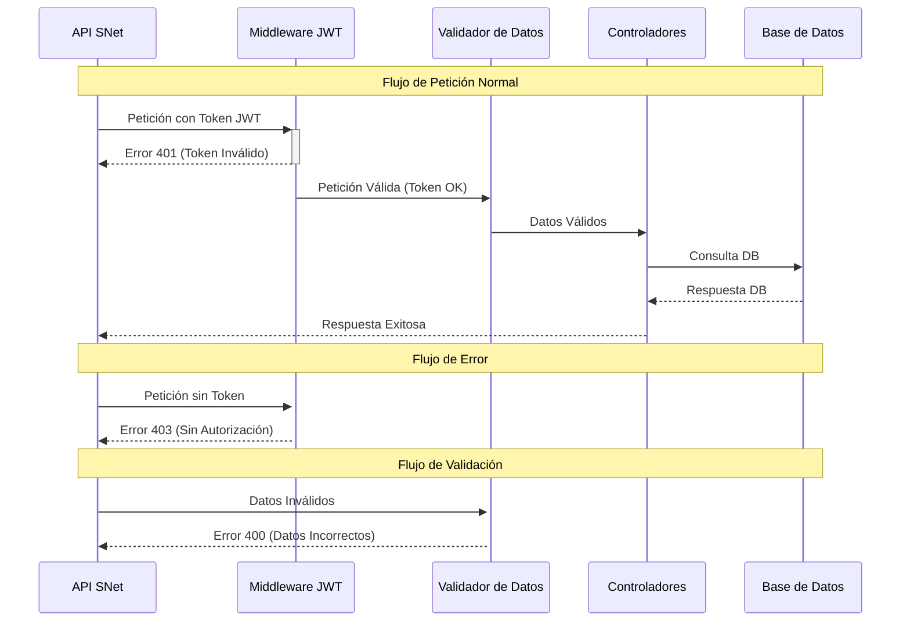
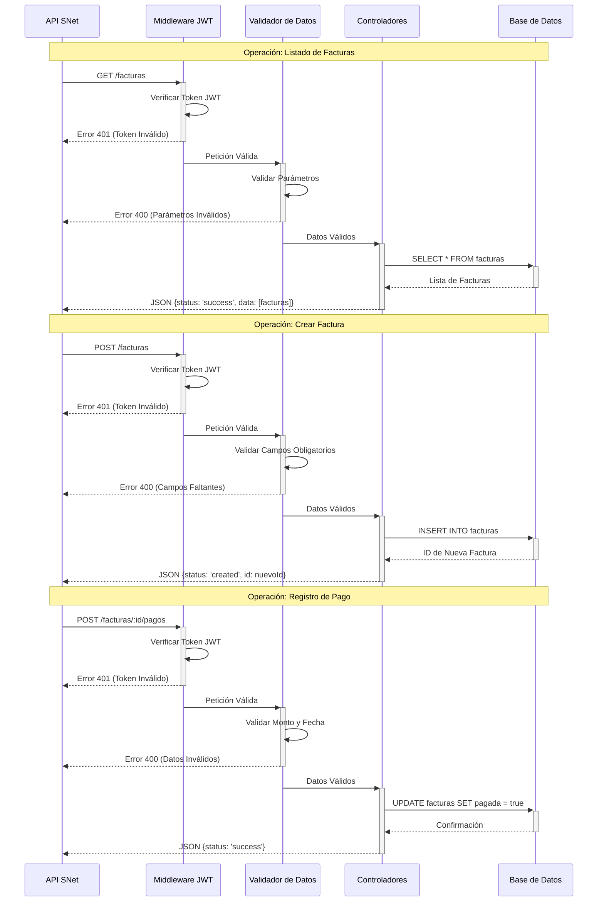

# Prompt
entiendo.
quiero que crees un diagram secuencial UML de un servidor hecho con expressJS.
este servidor recibe peticiones de una API llamada "SNet".
la API "SNet" consulta las rutas: Listado-facturas, crear-factura, registro-pago-factura.
Este servidor de expressJS consta de: Autenticacion con JWT, Validacion de Datos, consultas a la base de datos, manejo de errores.

# Respuesta.

Entiendo tu solicitud. Te ayudaré a crear un diagrama secuencial UML que muestre claramente el flujo de interacción entre la API SNet y el servidor ExpressJS, incluyendo todos los componentes solicitados.

### Flujo de Interacción

Para entender mejor el funcionamiento del sistema, primero veamos el flujo básico de una petición:

1. La API SNet realiza una petición HTTP al servidor
2. El servidor verifica la autenticación JWT
3. Se valida la estructura de los datos recibidos
4. Se procesan las operaciones en la base de datos
5. Se devuelve una respuesta apropiada

### Explicación del Diagrama

El diagrama anterior muestra tres flujos principales:

1. **Flujo Normal** (primera sección):
          - Las flechas sólidas (→) indican llamadas o peticiones
  - Las flechas punteadas (-->) indican respuestas
  - La secuencia muestra el proceso completo desde la petición hasta la respuesta exitosa

2. **Flujo de Error por Autenticación** (segunda sección):
          - Muestra cuando falta o es inválido el token JWT
  - El error 403 indica que no hay autorización

3. **Flujo de Validación** (tercera sección):
          - Ilustra el manejo de datos incorrectos
  - El error 400 indica problemas en la estructura de los datos

Veamos ahora el flujo específico para cada operación de SNet:

### Detalles de las Operaciones

Para cada operación de SNet, el servidor sigue este flujo detallado:

1. **Listado de Facturas** (GET /facturas):
          - Autenticación JWT obligatoria
  - Validación de parámetros opcionales (filtros, paginación)
  - Respuesta con código 200 y array de facturas

2. **Crear Factura** (POST /facturas):
          - Requiere campos obligatorios: fecha, monto, cliente
  - Validación de formato y valores
  - Respuesta con código 201 y ID de la nueva factura

3. **Registro de Pago** (POST /facturas/:id/pagos):
          - Requiere ID de factura válido
  - Validación de monto y fecha del pago
  - Actualización del estado de la factura
  - Respuesta con código 200 al completar

### Resumen de Operaciones

| Operación | Método | Ruta | Parámetros | Respuesta Exitosa |
| --- | --- | --- | --- | --- |
| Listado | GET | /facturas | Opcionales: página, límite | 200 + Array de facturas |
| Crear | POST | /facturas | fecha, monto, cliente | 201 + ID nueva factura |
| Registro Pago | POST | /facturas/:id/pagos | monto, fecha | 200 + Confirmación |

¿Necesitas alguna aclaración adicional sobre el flujo o las operaciones específicas?
