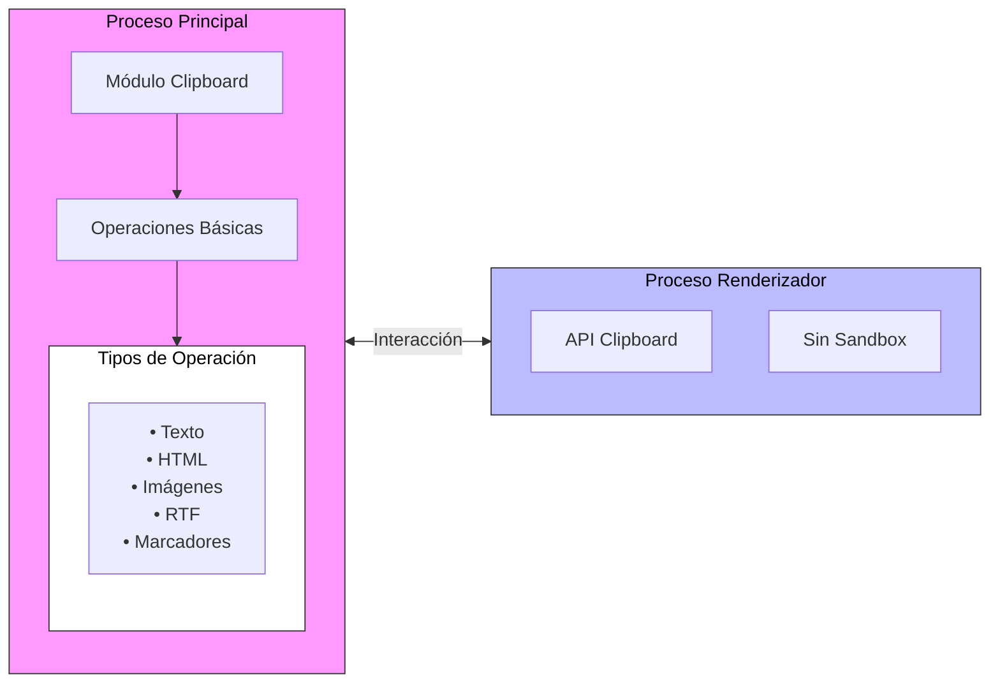

El módulo clipboard de Electron es una herramienta fundamental que permite realizar operaciones de copiar y pegar en aplicaciones desktop. Funciona tanto en el proceso principal como en el proceso renderizador (sin sandbox) 0:1, permitiendo una integración completa con el portapapeles del sistema operativo.



Como muestra el diagrama, el módulo clipboard funciona en dos procesos principales:

- El proceso principal (rosa): donde reside el módulo completo con todas sus capacidades
- El proceso renderizador (azul): que puede acceder al portapapeles pero requiere que la ventana no esté en modo sandbox para funcionar correctamente

Las flechas bidireccionales indican que ambos procesos pueden leer y escribir en el portapapeles del sistema. Veamos las diferentes formas de utilizar estas operaciones:

Operaciones básicas con texto```javascript
const { clipboard } = require('electron')

// Escribir texto al portapapeles
clipboard.writeText('Texto a copiar')

// Leer texto del portapapeles
const text = clipboard.readText()
console.log(text) // Muestra: Texto a copiar
```

- Simple y directo
- Funciona en todos los sistemas operativos
- Ideal para la mayoría de los casos de uso
- No mantiene formato
- Solo texto plano

Estas son las operaciones más comunes y simples 0:3 0:4. El método `writeText()` coloca el texto en el portapapeles, mientras que `readText()` recupera el contenido actual.
Operaciones con HTML```javascript
const { clipboard } = require('electron')

// Escribir HTML al portapapeles
clipboard.writeHTML('<b>Texto en negrita</b>')

// Leer HTML del portapapeles
const html = clipboard.readHTML()
console.log(html) // Muestra el HTML completo con metadatos
```

- Mantiene el formato HTML
- Útil para contenido estructurado
- Incluye metadatos automáticamente
- Más complejo que texto plano
- Puede requerir limpieza de metadatos

Los métodos `writeHTML()` y `readHTML()` 0:5 0:6 manejan contenido HTML completo, incluyendo metadatos como la codificación UTF-8 y otros atributos necesarios para el correcto funcionamiento.
Operaciones con imágenes```javascript
const { clipboard } = require('electron')

// Escribir imagen al portapapeles
clipboard.writeImage(nativeImage)

// Leer imagen del portapapeles
const image = clipboard.readImage()
```

- Soporte nativo para imágenes
- Integración completa con NativeImage
- Mantiene calidad de imagen
- Requiere manejo de NativeImage
- Mayor consumo de memoria

Los métodos `writeImage()` y `readImage()` 0:7 0:8 permiten trabajar con imágenes directamente en el portapapeles, utilizando el objeto NativeImage de Electron para mantener la calidad y compatibilidad.
### Características adicionales importantes

1. **Soporte multiplataforma**:
  - Windows: Soporta todas las operaciones básicas
  - macOS: Incluye funcionalidad adicional como marcadores
  - Linux: Ofrece un portapapeles de selección adicional 0:1


2. **Operaciones avanzadas**:
```javascript
// Limpiar el portapapeles
clipboard.clear()

// Verificar formato disponible
const formats = clipboard.availableFormats()
console.log(formats) // ['text/plain', 'text/html']
```


3. **Características específicas por plataforma**:
  - Linux: Usa `selection` como segundo portapapeles 0:1
  - macOS: Soporta marcadores con título y URL 0:11 0:12
  - Windows: Limitado en algunos formatos especiales 0:12


¿Te gustaría profundizar en algún aspecto específico del funcionamiento del clipboard?
