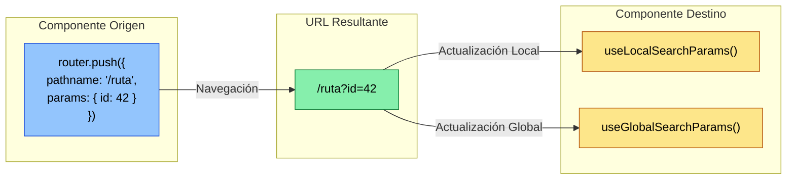
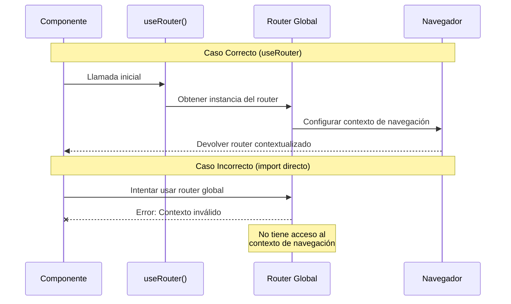

### Conceptos Fundamentales

Expo Router proporciona dos tipos principales de parámetros 1:1:

1. **Parámetros de ruta**: Se utilizan para identificar segmentos dinámicos en la URL (ejemplo: `/user/[id]`)
2. **Parámetros de búsqueda**: Se agregan después del símbolo ? en la URL (ejemplo: `?nombre=Juan&edad=25`)

Para acceder a estos parámetros, Expo Router ofrece dos hooks principales 1:2:

- `useLocalSearchParams`: Actualiza solo cuando el componente está enfocado
- `useGlobalSearchParams`: Se actualiza con cualquier cambio en los parámetros

Veamos un diagrama que ilustra el flujo de parámetros entre componentes:



Como muestra el diagrama, cuando enviamos parámetros desde un componente origen, estos se convierten en parte de la URL. Los hooks `useLocalSearchParams` y `useGlobalSearchParams` permiten acceder a estos parámetros en el componente destino, cada uno con su propio comportamiento de actualización.

### Métodos Prácticos para Pasar Parámetros

Usando router.push con objeto params```javascript
import { useRouter } from 'expo-router';

function Origen() {
  const router = useRouter();
  
  const navegar = () => {
    router.push({
      pathname: '/detalles',
      params: { 
        id: 42,
        nombre: "Juan",
        datos: { ciudad: "Madrid" }
      }
    });
  };
}

function Destino() {
  const { id, nombre, datos } = useLocalSearchParams();
  return (
    <View>
      <Text>ID: {id}</Text>
      <Text>Nombre: {nombre}</Text>
      <Text>Ciudad: {datos.ciudad}</Text>
    </View>
  );
}
```

- Más flexible y poderoso
- Permite pasar objetos complejos
- Mejor para navegación programática
- Requiere más código inicial
- Puede ser excesivo para casos simples
Este método es ideal cuando necesitas pasar datos complejos o realizar navegación programática basada en eventos del usuario. El hook `useRouter` te da acceso al objeto router que permite una navegación más controlada 1:4.Usando Link con parámetros de búsqueda```javascript
import { Link } from 'expo-router';

function Origen() {
  return (
    <Link 
      href={{
        pathname: '/detalles',
        params: { id: 42, nombre: "Juan" }
      }}
    >
      Ir a detalles
    </Link>
  );
}

function Destino() {
  const { id, nombre } = useLocalSearchParams();
  return (
    <View>
      <Text>ID: {id}</Text>
      <Text>Nombre: {nombre}</Text>
    </View>
  );
}
```

- Más simple y directo
- Ideal para enlaces estáticos
- Mejor rendimiento para casos simples
- Menos flexible para navegación dinámica
- No tan adecuado para objetos complejos
Este método es perfecto para enlaces estáticos en tu interfaz. El componente `Link` maneja automáticamente la serialización de los parámetros y crea URLs limpias 0:1.### Tipos Avanzados

Puedes usar TypeScript para tener un mejor control sobre los tipos de tus parámetros 1:3:

```typescript
interface ParametrosRuta {
  id: string;
  nombre?: string;
  datos?: {
    ciudad: string;
  };
}

function ComponenteDestino() {
  const { id, nombre, datos } = useLocalSearchParams<ParametrosRuta>();
  // Ahora tienes autocompletado y validación de tipos
}
```

### Consejos Importantes

1. Para parámetros simples, usa `Link` con el atributo `href` directamente
2. Para navegación dinámica o datos complejos, usa `router.push`
3. En aplicaciones con múltiples pantallas abiertas, prefiere `useLocalSearchParams` sobre `useGlobalSearchParams` para mejor rendimiento 1:2
4. Si necesitas actualizar parámetros sin cambiar de ruta, puedes usar `router.setParams` 1:4

¿Necesitas ejemplos más específicos o tienes alguna duda sobre algún caso de uso en particular?


---
---


# POR QUE USAR `useRotuer` y no `router`(importacion directa).

La razón principal por la que debemos usar `useRouter` en lugar de importar directamente el router es que este hook nos proporciona una instancia del router específicamente vinculada al contexto de nuestro componente. Veamos exactamente qué significa esto:



Como puedes ver en el diagrama, cuando usamos `useRouter`, el hook actúa como un intermediario que asegura que recibimos una instancia del router correctamente configurada para nuestro componente. Si intentamos usar el router directamente, perdemos esta configuración crucial del contexto de navegación.

Veamos las diferencias prácticas entre ambos enfoques:

Usando el hook useRouter (recomendado)

```javascript
import { useRouter } from 'expo-router';

function MiComponente() {
  const router = useRouter();
  
  // El router está correctamente configurado para este componente
  const navegar = () => {
    router.push({
      pathname: '/detalles',
      params: { id: 42 }
    });
  };
}
```

- Garantiza acceso al contexto de navegación correcto
- Funciona con cualquier estructura de componentes
- Maneja automáticamente la limpieza del estado
- Requiere una línea adicional de código
El hook `useRouter` se asegura de que tengamos acceso al router en el contexto correcto de nuestro componente. Esto es especialmente importante cuando trabajamos con componentes anidados o layouts complejos.Importando directamente el router (no recomendado)


```javascript
import { router } from 'expo-router';

function MiComponente() {
  // Este router podría no tener el contexto correcto
  const navegar = () => {
    router.push({
      pathname: '/detalles',
      params: { id: 42 }
    });
  };
}
```

- Código más corto
- Menos importaciones
- Puede causar errores de contexto
- No garantiza el funcionamiento correcto en todos los casos
- Puede llevar a comportamientos inesperados
Importar el router directamente puede funcionar en casos simples, pero no es una práctica recomendada porque no garantiza que tengamos acceso al contexto de navegación correcto para nuestro componente.La razón principal por la que Expo Router está diseñado para usar hooks es seguir el principio de "React Context Pattern". Este patrón asegura que cada componente tenga acceso al estado y las funciones que necesita en su ámbito específico, evitando problemas comunes como:

- Perdida del contexto de navegación
- Problemas con componentes anidados
- Errores de sincronización entre rutas

