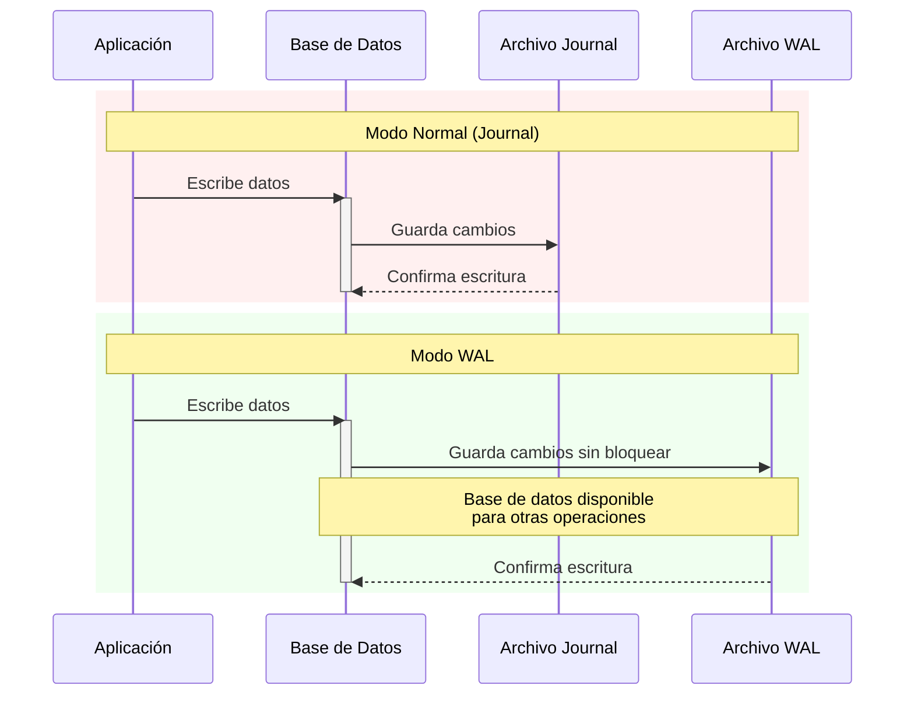

La sentencia `PRAGMA journal_mode = WAL` configura el modo de funcionamiento de SQLite para mejorar el rendimiento y la confiabilidad de la base de datos. Veamos exactamente qué hace:



Para entender mejor el diagrama anterior:

- En rojo (modo normal): SQLite bloquea completamente la base de datos durante las escrituras, lo que significa que ninguna otra operación puede acceder mientras se realizan cambios
- En verde (modo WAL): La base de datos permanece disponible para otras operaciones mientras se escriben los cambios en el archivo WAL

Veamos la documentación técnica detallada:

```javascript
/**
 * Configura el modo Write-Ahead Logging (WAL) para SQLite.
 * Este modo optimiza el rendimiento al permitir lecturas concurrentes durante escrituras.
 *
 * @description
 * El modo WAL mantiene un archivo separado (.wal) donde se registran todos los cambios antes
 * de aplicarlos a la base de datos principal. Esto permite:
 * - Operaciones de lectura sin bloqueos
 * - Mejor concurrencia
 * - Mayor seguridad contra fallos
 * - Compromiso ACID garantizado
 */
PRAGMA journal_mode = WAL;
```

### Beneficios Principales

1. **Rendimiento Mejorado**:
          - Las consultas SELECT no se bloquean durante las escrituras
  - Múltiples conexiones pueden leer simultáneamente
  - Las operaciones de escritura son más rápidas


2. **Confiabilidad**:
          - Los cambios se registran primero en el archivo WAL
  - Si falla una escritura, la base de datos permanece intacta
  - Facilita la recuperación en caso de fallos


3. **Ventajas Prácticas**:
          - Ideal para aplicaciones con múltiples usuarios
  - Mejor manejo de concurrencia
  - Reduce la probabilidad de corrupción de datos


### Consideraciones Importantes

- Requiere espacio adicional en disco para el archivo .wal
- Puede generar overhead en sistemas con poca memoria
- No es necesario para bases de datos de solo lectura
- Se debe usar con precaución en dispositivos con espacio limitado

Esta configuración es especialmente útil en aplicaciones móviles como las desarrolladas con Expo, donde el rendimiento y la confiabilidad son cruciales para una experiencia de usuario fluida.
