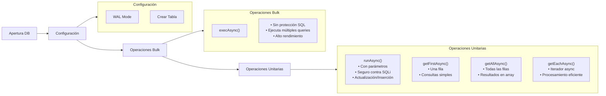

Este código demuestra diferentes formas de interactuar con una base de datos SQLite usando Expo. Veamos cómo funciona paso a paso:

### Flujo de Operaciones



### Documentación Detallada

```javascript
/**
 * Abre una conexión asíncrona a la base de datos SQLite.
 * @async
 * @param {string} databaseName - Nombre del archivo de la base de datos
 * @returns {Promise<SQLite.WebSQL.Database>} Promesa que resuelve con el objeto de la base de datos
 */
const db = await SQLite.openDatabaseAsync('databaseName');

/**
 * Ejecuta múltiples comandos SQL en una sola transacción.
 * Útil para operaciones bulk, pero NO ESCAPA PARÁMETROS.
 * 
 * @async
 * @function execAsync
 * @param {string} sql - Comandos SQL separados por punto y coma
 * @throws {Error} Si ocurre un error durante la ejecución
 * @example
 * await db.execAsync(`
 *   PRAGMA journal_mode = WAL;
 *   CREATE TABLE IF NOT EXISTS test (
 *     id INTEGER PRIMARY KEY NOT NULL,
 *     value TEXT NOT NULL,
 *     intValue INTEGER
 *   );
 *   INSERT INTO test (value, intValue) VALUES ('test1', 123);
 * `);
 */
await db.execAsync(`
  PRAGMA journal_mode = WAL;
  CREATE TABLE IF NOT EXISTS test (id INTEGER PRIMARY KEY NOT NULL, value TEXT NOT NULL, intValue INTEGER);
  INSERT INTO test (value, intValue) VALUES ('test1', 123);
  INSERT INTO test (value, intValue) VALUES ('test2', 456);
  INSERT INTO test (value, intval) VALUES ('test3', 789);
`);

/**
 * Ejecuta una operación de escritura segura con parámetros vinculados.
 * Protege contra inyección SQL mediante parámetros preparados.
 * 
 * @async
 * @function runAsync
 * @param {string} sql - Sentencia SQL con marcadores de posición (? o $nombre)
 * @param {...any|Array<any>|Object<string,any>} params - Parámetros para vincular
 * @returns {object} Objeto con propiedades lastInsertRowId y changes
 * @example
 * // Con parámetros individuales
 * await db.runAsync('INSERT INTO test (value, intValue) VALUES (?, ?)', 'aaa', 100);
 * 
 * // Con array de parámetros
 * await db.runAsync('UPDATE test SET intValue = ? WHERE value = ?', [999, 'aaa']);
 * 
 * // Con objeto de parámetros nombrados
 * await db.runAsync('DELETE FROM test WHERE value = $value', { $value: 'aaa' });
 */
const result = await db.runAsync('INSERT INTO test (value, intValue) VALUES (?, ?)', 'aaa', 100);
console.log(result.lastInsertRowId, result.changes);

/**
 * Obtiene la primera fila de resultados de una consulta SQL.
 * Útil cuando solo necesitas un registro específico.
 * 
 * @async
 * @function getFirstAsync
 * @param {string} sql - Sentencia SQL SELECT
 * @returns {object|null} Objeto con los datos de la primera fila o null si no hay resultados
 * @example
 * const firstRow = await db.getFirstAsync('SELECT * FROM test');
 */
const firstRow = await db.getFirstAsync('SELECT * FROM test');

/**
 * Obtiene todas las filas de resultados como un array de objetos.
 * Útil para procesar múltiples registros simultáneamente.
 * 
 * @async
 * @function getAllAsync
 * @param {string} sql - Sentencia SQL SELECT
 * @returns {Array<object>} Array con todos los resultados
 * @example
 * const allRows = await db.getAllAsync('SELECT * FROM test');
 */
const allRows = await db.getAllAsync('SELECT * FROM test');

/**
 * Crea un iterador asíncrono para recorrer los resultados de una consulta SQL.
 * Ideal para manejar grandes conjuntos de datos de manera eficiente.
 * 
 * @async
 * @function getEachAsync
 * @param {string} sql - Sentencia SQL SELECT
 * @yields {object} Objeto con los datos de cada fila
 * @example
 * for await (const row of db.getEachAsync('SELECT * FROM test')) {
 *   console.log(row.id, row.value, row.intValue);
 * }
 */
for await (const row of db.getEachAsync('SELECT * FROM test')) {
  console.log(row.id, row.value, row.intValue);
}
```

### Notas Importantes

1. **Seguridad**:
          - `execAsync()` NO debe usarse con datos dinámicos
  - Siempre usa `runAsync()` para operaciones que involucren parámetros
  - Los parámetros pueden ser individuales (?), arrays ([val1, val2]), u objetos nombrados ({ $nombre: valor })


2. **Rendimiento**:
          - `getAllAsync()` carga todos los resultados en memoria
  - `getEachAsync()` es más eficiente para grandes conjuntos de datos
  - `execAsync()` es óptimo para múltiples operaciones relacionadas


3. **Transacciones**:
          - Las operaciones bulk en `execAsync()` se ejecutan en una sola transacción
  - Esto garantiza la integridad de los datos al realizar múltiples operaciones


Esta documentación proporciona una guía completa y segura para el uso de SQLite en Expo, siguiendo las mejores prácticas de seguridad y rendimiento mostradas en el diagrama anterior.
